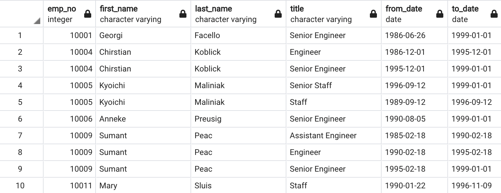
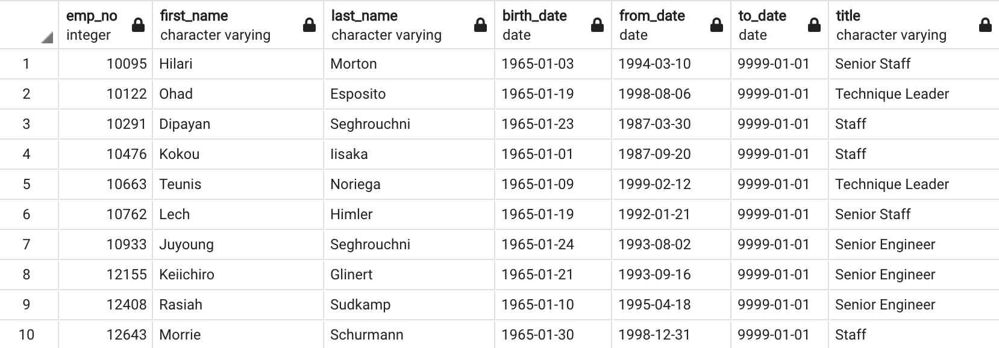

# Pewlett-Hackard-Analysis

## Overview of the project

### Purpose

The purpose of this project is to determine the number of retiring employees per title and identify employees who are eligible to participate in a mentorship program in order to analyze the “silver tsunami” of Company as many current employees reach retirement age.

## Results

1. The retirement_titles.csv shows all the employees who were born between 1952 and 1955 with their job position by inner joining Employees table and Titles table on the primary key. The data on the birth_date column was filtered between 1952 and 1955, then, ordered by the employee number. As the figure shown below, we can see there are duplicate entries for some employees, such as employee number = 10004, 10005, and 10009.

2. The unique_titles.csv shows all the retiring employees with their most recent job title. It was created by removing the duplicate entries in retirement_titles.csv and keep only the most recent title of each retiring employee. DISTINCT ON statement was used to retrieve the first occurrence of the employee number for each set of rows. This table was sorted in ascending order by the employee number and descending order by the last date of the most recent title. As the figure shown below, we can see that most retiring employees had a Senior position in their job title.

3. The retiring_titles.csv (Figure below) shows the number of retiring employees of each job title. It was created by grouping the unique_titles table by title. COUNT statement was used to count the number of retiring employees for each job title, then the count column was sorted in descending order. As shown in Figure below, we can see that Senior Engineers have the highest count of retirees, while Managers have the lowest count.

4. The mentorship_eligibilty.csv shows the information of employees who are eligible to participate in a mentorship program. It was created by inner joining three tables (Employees Table, Department Employees Table, and Titles Table). DISTINCT ON statement was used to retrieve the first occurrence of the employee number for each set of rows. The  to_date and the birth_date column were filtered to get current employees whose birth dates are between January 1, 1965 and December 31, 1965.

## Summary

- How many roles will need to be filled as the "silver tsunami" begins to make an impact?

  By counting the sum of count column of retiring_titles table, we can find that there are 90398 retiring employees will soon need to be filled as the "silver tsunami" begins to make an impact.

  

- Are there enough qualified, retirement-ready employees in the departments to mentor the next generation of Pewlett Hackard employees?

  By counting the number of rows in mentorship_eligibility table (Figure below), we can find that there are 1549 qualified, retirement-ready employees in the company to mentor the next generation of Pewlett Hackard employees.

  
